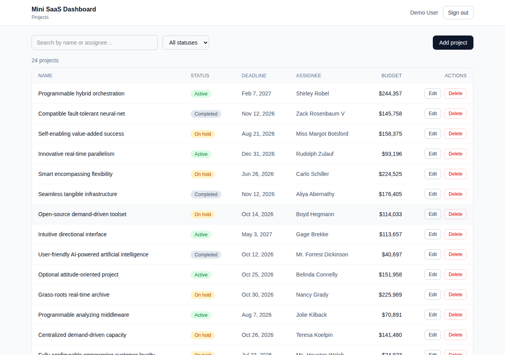
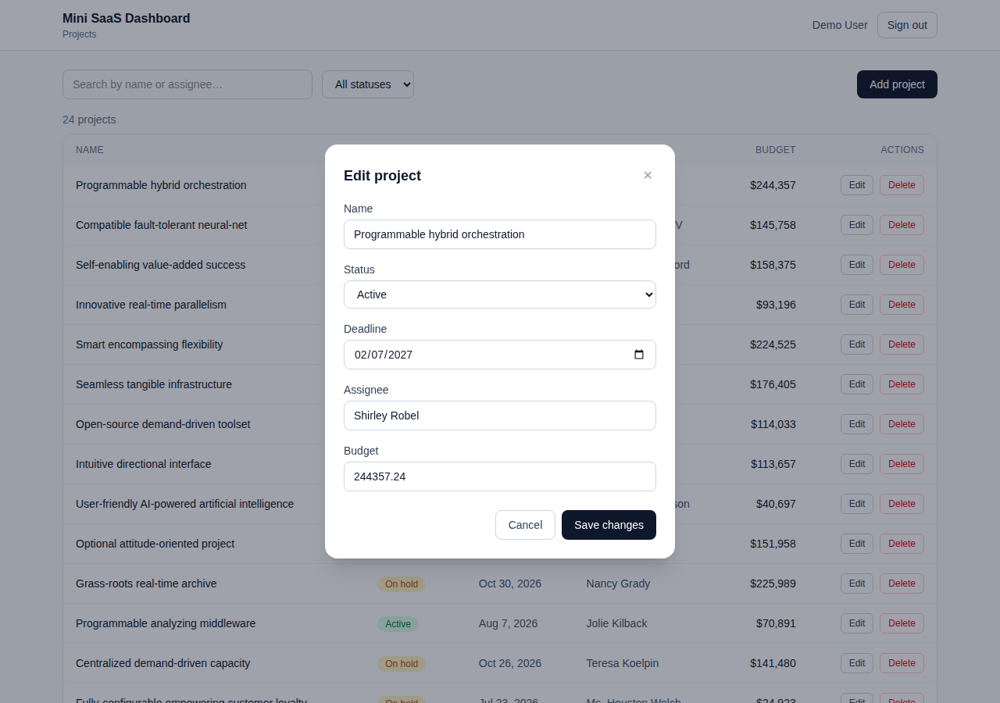
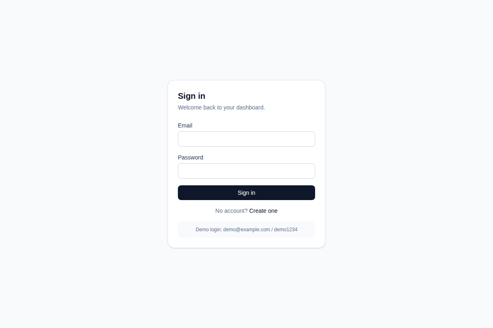
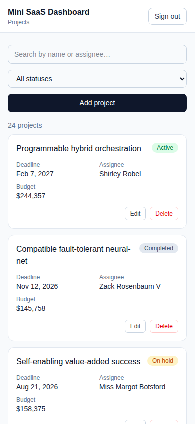

# Mini SaaS Dashboard

<!-- Replace OWNER/REPO with your GitHub path after pushing. -->
<!--  -->

A small full-stack SaaS dashboard for managing projects — list, search, filter by
status, paginate, and create / edit / delete — behind JWT authentication.

Built with Next.js (App Router), PostgreSQL, and Prisma.

## Features

- **Projects CRUD** with fields: name, status (`Active` / `On hold` / `Completed`),
  deadline, assigned team member, and budget
- **Search** by name or assignee, **filter** by status, and **server-side pagination**
- **Responsive UI** — table on desktop, cards on mobile
- **Add / edit modal** with client- and server-side validation
- **Delete** with a confirmation dialog and toast feedback
- **Authentication** — register / login / logout with JWT in an httpOnly cookie;
  projects are scoped to the signed-in user
- **REST API** with owner authorization on every endpoint
- **Seed script** generating a demo user and 24 sample projects
- **Production-ready**: fail-fast env validation, security headers, rate-limited
  auth, generic error handling, a health check, and a non-root Docker image

## Tech stack

| Area       | Choice                                  |
| ---------- | --------------------------------------- |
| Framework  | Next.js 16 (App Router) + TypeScript    |
| Styling    | Tailwind CSS                            |
| Data layer | PostgreSQL + Prisma (pg driver adapter) |
| API        | Next.js Route Handlers (REST)           |
| Auth       | JWT (`jose`) + bcrypt, httpOnly cookie  |
| Validation | Zod (shared between client and server)  |
| Client     | React Query for fetching and caching    |
| Container  | Docker + Docker Compose                 |

## Screenshots

| Dashboard                               | Add / edit modal                |
| --------------------------------------- | ------------------------------- |
|  |  |

| Login                           | Mobile                            |
| ------------------------------- | --------------------------------- |
|  |  |

## Quick start (Docker)

The fastest way to run everything (database, migrations, seed, and app):

```bash
docker compose -f docker-compose.app.yml up --build
```

Then open <http://localhost:3000> and sign in with the demo account:

- **Email:** `demo@example.com`
- **Password:** `demo1234`

## Local development

Requires Node.js 22+ and Docker (for PostgreSQL).

```bash
# 1. Install dependencies (also generates the Prisma client)
npm install

# 2. Create your env file
cp .env.example .env

# 3. Start PostgreSQL (host port 5434)
npm run db:up

# 4. Apply migrations
npm run db:migrate

# 5. Seed the demo user and sample projects
npm run db:seed

# 6. Start the dev server
npm run dev
```

The app runs at <http://localhost:3000>.

> The local database is mapped to host port **5434** (not the default 5432) to
> avoid clashing with other local Postgres instances. Adjust `DATABASE_URL` in
> `.env` if you change it.

## Environment variables

| Variable       | Description                                          |
| -------------- | ---------------------------------------------------- |
| `DATABASE_URL` | PostgreSQL connection string                         |
| `JWT_SECRET`   | Secret used to sign auth tokens (use a random value) |

See `.env.example` for defaults that match the local Docker database.

## Scripts

| Script               | Description                   |
| -------------------- | ----------------------------- |
| `npm run dev`        | Start the dev server          |
| `npm run build`      | Production build              |
| `npm run start`      | Start the production server   |
| `npm run lint`       | Run ESLint                    |
| `npm run format`     | Format with Prettier          |
| `npm run db:up`      | Start the Postgres container  |
| `npm run db:down`    | Stop the Postgres container   |
| `npm run db:migrate` | Apply Prisma migrations       |
| `npm run db:seed`    | Seed demo data (idempotent)   |
| `npm run db:reset`   | Reset the database and reseed |

## API reference

All `/api/projects` routes require authentication and only return or modify the
signed-in user's projects.

### Auth

| Method | Endpoint             | Description                        |
| ------ | -------------------- | ---------------------------------- |
| POST   | `/api/auth/register` | Create an account and sign in      |
| POST   | `/api/auth/login`    | Sign in                            |
| POST   | `/api/auth/logout`   | Sign out (clears the cookie)       |
| GET    | `/api/auth/me`       | Current user, or 401 if signed out |

Auth endpoints are rate-limited per IP (login 10/min, register 5/min) and return
`429` with a `Retry-After` header when exceeded.

### Projects

| Method | Endpoint            | Description                                               |
| ------ | ------------------- | --------------------------------------------------------- |
| GET    | `/api/projects`     | List projects; `?status=`, `?search=`, `?page=` (10/page) |
| POST   | `/api/projects`     | Create a project                                          |
| GET    | `/api/projects/:id` | Get one project                                           |
| PATCH  | `/api/projects/:id` | Update a project                                          |
| DELETE | `/api/projects/:id` | Delete a project                                          |

The list endpoint returns `{ projects, total, page, pageSize }`.

### Health

| Method | Endpoint      | Description                                 |
| ------ | ------------- | ------------------------------------------- |
| GET    | `/api/health` | Readiness probe; `200` ok, `503` if DB down |

Example:

```bash
# Log in and store the cookie
curl -c cookie.txt -X POST http://localhost:3000/api/auth/login \
  -H "Content-Type: application/json" \
  -d '{"email":"demo@example.com","password":"demo1234"}'

# List active projects matching "platform", page 1
curl -b cookie.txt "http://localhost:3000/api/projects?status=ACTIVE&search=platform&page=1"
```

## Project structure

```
prisma/
  schema.prisma          # User and Project models
  migrations/            # SQL migrations
  seed.ts                # Demo user + sample projects
src/
  app/
    api/                 # Auth and projects route handlers
    dashboard/           # Protected dashboard (server-side guard)
    login/ register/     # Auth pages
  components/
    projects/            # Table, toolbar, form modal, view
    ui/                  # Modal, toast, confirm dialog, text field
    auth-provider.tsx    # Client auth context
    query-provider.tsx   # React Query provider
  hooks/                 # Data fetching and mutations
  lib/                   # db, auth, validation, api helpers, formatting
.github/workflows/      # CI (lint, typecheck, build)
Dockerfile               # Multi-stage build (standalone runner + migrator)
docker-compose.yml       # Postgres for local dev
docker-compose.app.yml   # Full stack (db + migrate + app)
```

## Production deployment

The production stack is `docker-compose.app.yml`, which runs three services:

1. `db` — PostgreSQL
2. `migrate` — runs `prisma migrate deploy` (and an optional seed) once, then exits
3. `app` — the Next.js standalone server (runs as a non-root user, with a
   container health check on `/api/health`)

```bash
# Set a strong secret, then build and start the stack
export JWT_SECRET="$(openssl rand -base64 32)"
docker compose -f docker-compose.app.yml up --build -d
```

Deployment checklist:

- **`JWT_SECRET`** — set a strong value (≥32 chars); the app refuses to start otherwise.
- **HTTPS** — run behind a TLS-terminating reverse proxy (e.g. Nginx, Caddy, a load
  balancer). Auth cookies are `Secure` in production and the app sends HSTS.
- **Seeding** — set `RUN_SEED=false` (or remove it) on the `migrate` service so a
  production database is not populated with demo data.
- **Scaling** — the auth rate limiter is in-memory; back it with Redis if you run
  multiple replicas.

## Deploy to Vercel + Supabase

1. **Create a Supabase project** and open **Project Settings → Database**. Copy two
   connection strings:
   - **Transaction pooler** (port `6543`) — for the app at runtime (`DATABASE_URL`).
   - **Direct connection** (port `5432`) — for running migrations from your machine.
2. **Migrate and seed the hosted database** from your machine using the direct URL:
   ```bash
   DATABASE_URL="<direct-connection-string>" npm run db:deploy
   DATABASE_URL="<direct-connection-string>" npm run db:seed   # optional demo data
   ```
3. **Import the GitHub repo into Vercel** and add Environment Variables (Production
   and Preview):
   - `DATABASE_URL` = the **transaction pooler** string (port `6543`)
   - `JWT_SECRET` = a strong value, e.g. `openssl rand -base64 32`
4. **Deploy.** Vercel runs `npm install` (which generates the Prisma client) and
   `next build`. Set the env vars _before_ the first build, since startup validation
   requires them.

> Migrations must use the direct connection (the transaction pooler does not support
> the DDL/locks they need). The app at runtime should use the pooler.

## Security

- Passwords hashed with bcrypt; JWT stored in an httpOnly, same-site cookie.
- Fail-fast environment validation (`DATABASE_URL`, `JWT_SECRET`) at startup.
- Security headers on every response: CSP, HSTS, `X-Frame-Options`,
  `X-Content-Type-Options`, `Referrer-Policy`, `Permissions-Policy`.
- Rate-limited auth endpoints; unexpected errors return generic 500s (no leakage).
- Every project endpoint authorizes by owner, so users only see their own data.

## Notes

- Passwords are hashed with bcrypt; the JWT is stored in an httpOnly,
  same-site cookie and verified on protected routes.
- The dashboard is guarded server-side, so unauthenticated requests are
  redirected to `/login` before any data is rendered.
- The seed script is idempotent — it replaces the demo user's projects on each
  run, so it is safe to run repeatedly.
